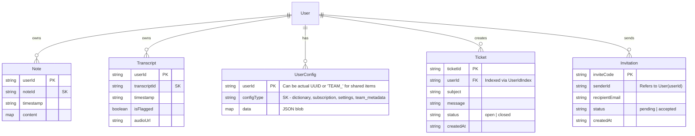

# Data Structure & Relationships

This document outlines the data structure for the `elixir_voicescribe_backend`, which uses **Amazon DynamoDB** as its data store.

## Overview

The application uses a set of DynamoDB tables to manage its data. Unlike a relational database (SQL) with strict foreign keys, relationships here are implicit (references by ID).

### Tables identified:

| Resource | Logic Table Name | Partition Key (PK) | Sort Key (SK) | GSI (Indexes) | Description |
| :--- | :--- | :--- | :--- | :--- | :--- |
| **Notes** | `NotesTable` | `userId` | `noteId` | - | Stores user notes. |
| **Configs** | `UserConfigsTable` | `userId` | `configType` | - | Stores various user configurations (dictionary, settings, etc.). |
| **Transcripts** | `TranscriptsTable` | `userId` | `transcriptId` | - | Stores audio transcripts. |
| **Invitations** | `InvitationsTable` | `inviteCode` | - | - | Manages sharing/invitations. |
| **Tickets** | `TicketsTable` | `ticketId` | - | `UserIdIndex` | Support tickets created by users. |

---

## Entity Relationships Diagram (Mermaid)

To view this diagram, use a Markdown preview that supports Mermaid (like GitHub or **Markdown Preview Mermaid Support** extension in VS Code).

## Detailed Schemas

### 1. Notes (`NotesTable`)
*   **Access Pattern**: Query by `userId` to get all notes for a user. Get specific note by `userId` + `noteId`.
*   **Fields**:
    *   `userId`: The owner's ID.
    *   `noteId`: Unique UUID for the note.
    *   `timestamp`: ISO8601 creation time.
    *   `...params`: Any other JSON fields passed during creation.

### 2. User Configs (`UserConfigsTable`)
*   **Access Pattern**: Get specific config by `userId` + `configType`.
*   **Known `configType` values**:
    *   `dictionary`: Custom words lists.
    *   `subscription`: Plan info properties.
    *   `onboarding`: Onboarding status.
    *   `settings`: General app settings.
    *   `snippets`: Text snippets.
    *   `style_preferences`: UI theme/style preferences.

### 3. Transcripts (`TranscriptsTable`)
*   **Access Pattern**: Query by `userId` (supports pagination via `Limit` and `ExclusiveStartKey`).
*   **Fields**:
    *   `userId`: Owner.
    *   `transcriptId`: Unique ID.
    *   `timestamp`: Creation time.
    *   `isFlagged`: Boolean flag.
    *   `audioUrl`: Link to audio file (S3).

### 4. Invitations (`InvitationsTable`)
*   **Access Pattern**: Direct lookup by `inviteCode`.
*   **Fields**:
    *   `inviteCode`: The token sent in the email.
    *   `senderId`: The User ID who sent it.
    *   `recipientEmail`: Target email.
    *   `status`: Status tracking (e.g., "pending").

### 5. Tickets (`TicketsTable`)
*   **Access Pattern**: Lookup by `ticketId`. Query all tickets for a user via `UserIdIndex`.
*   **Fields**:
    *   `ticketId`: Unique ID.
    *   `userId`: Creator's ID.
    *   `subject`: Ticket subject.
    *   `message`: Ticket content.
    *   `status`: e.g., "open".
